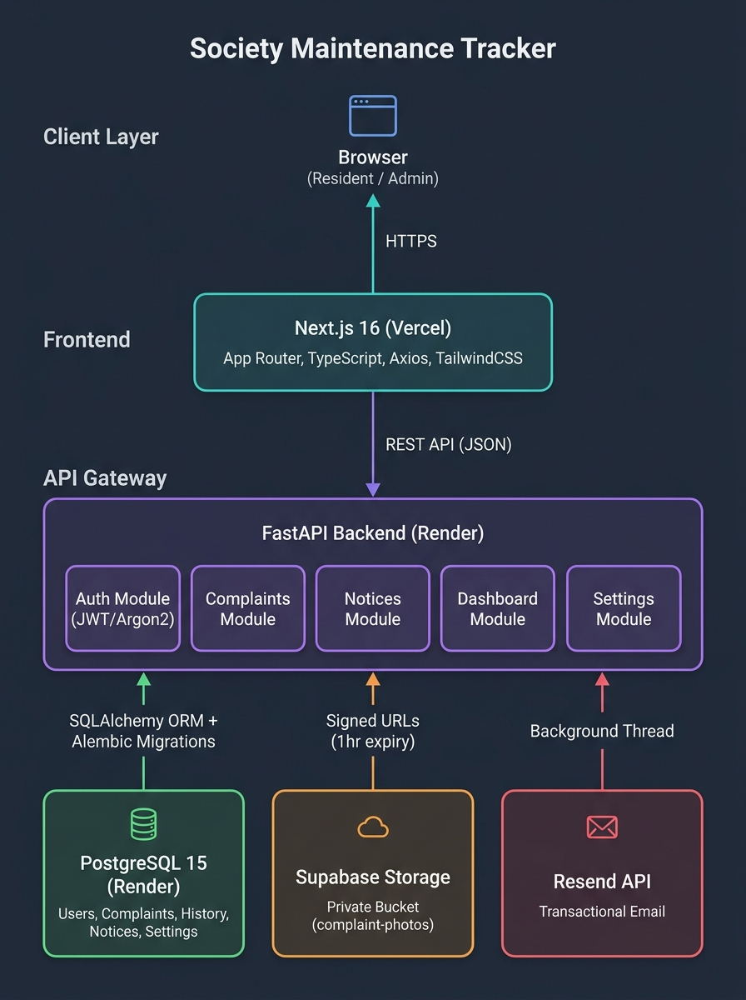
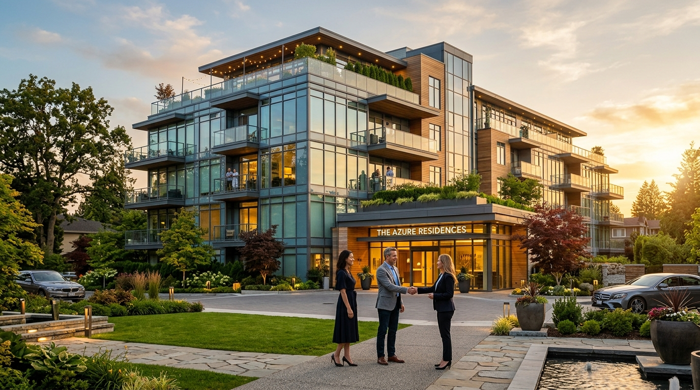
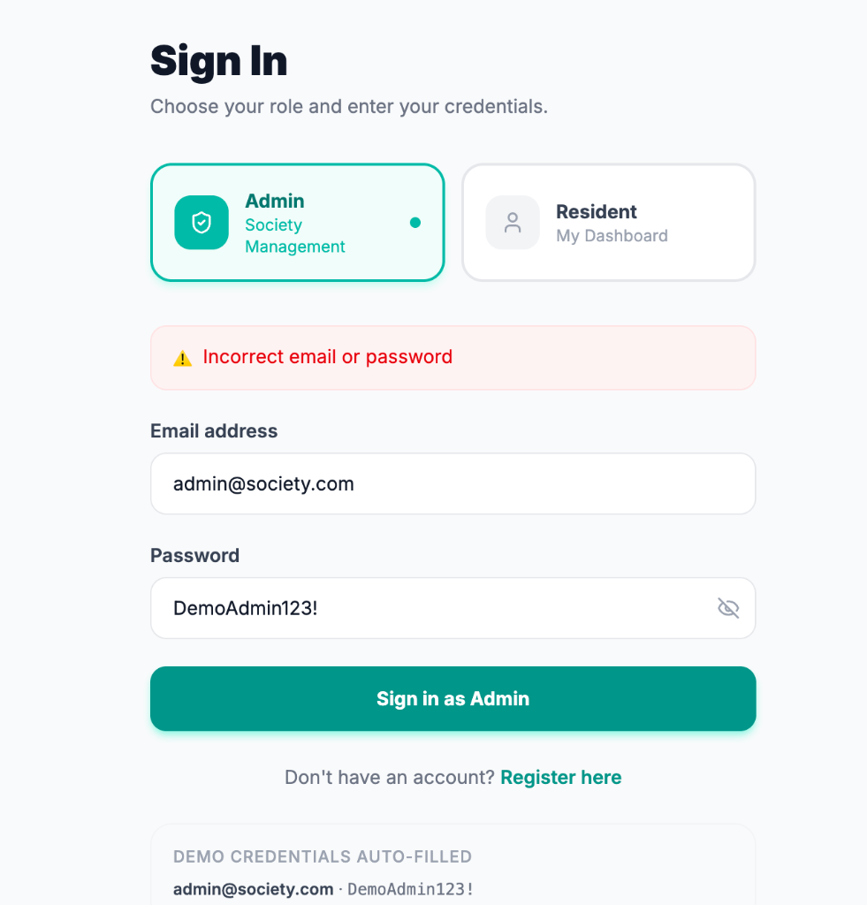
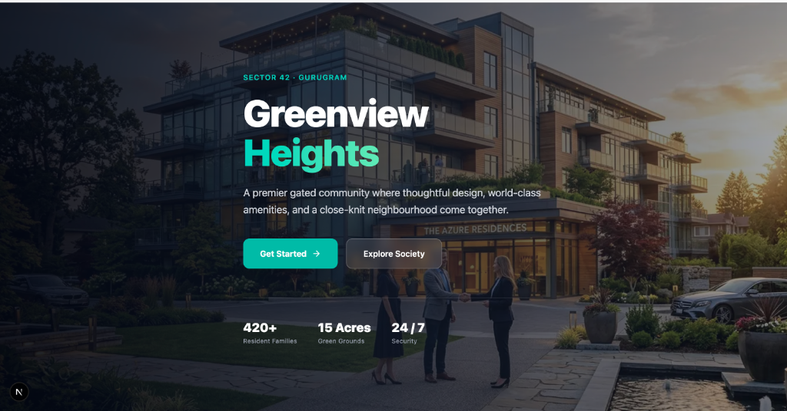
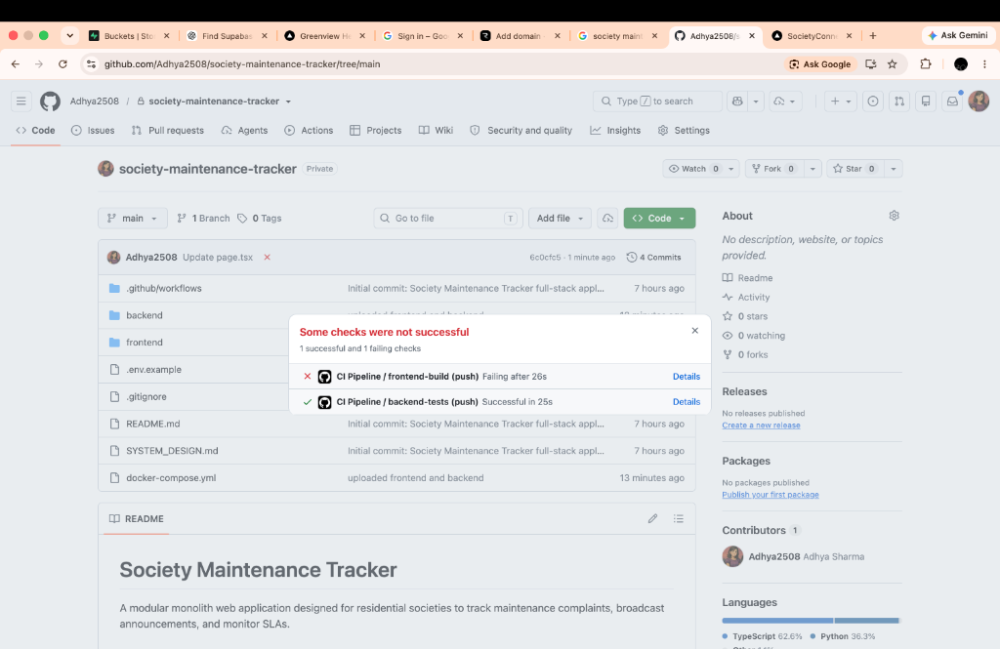

# 🏢 Greenview Heights — Society Maintenance Tracker

[](https://society-maintenance-tracker-dusky.vercel.app)
[](https://youtu.be/Mrlt2Wc0yrI?si=z0mIoQl6j55xNxCW)
[](https://society-maintenance-tracker-8y4e.onrender.com/api/docs)
[](https://render.com)

A modern, full-stack complaint management and community notice portal designed for residential housing societies and gated communities. Built with **Next.js 16**, **FastAPI**, **PostgreSQL**, **Supabase Storage**, and **Resend**.

---

## 🚀 Live Deployment Links

> 🌐 **Live Web Application:** [https://society-maintenance-tracker-dusky.vercel.app](https://society-maintenance-tracker-dusky.vercel.app)  
> 📺 **YouTube Video Walkthrough:** [https://youtu.be/Mrlt2Wc0yrI?si=z0mIoQl6j55xNxCW](https://youtu.be/Mrlt2Wc0yrI?si=z0mIoQl6j55xNxCW)  
> ⚡ **Swagger API Documentation:** [https://society-maintenance-tracker-8y4e.onrender.com/api/docs](https://society-maintenance-tracker-8y4e.onrender.com/api/docs)

---

## 🔑 Demo Access Credentials

The database comes pre-seeded with sample residents, complaints, and notice board broadcasts:

| Role | Email | Password | Access Area |
|---|---|---|---|
| **Admin** | `admin@society.com` | `DemoAdmin123!` | Society Dashboard, SLA Controls, Notice Creation |
| **Resident** | `ravi@society.com` | `DemoResident123!` | File Complaints, Photo Uploads, Community Feed |
| **Resident 2** | `priya@society.com` | `DemoResident123!` | Resident Dashboard & Personal Complaints |

---

## 🏛️ System Architecture



The platform follows a clean **Modular Monolith** architecture:
* **Frontend Layer**: Next.js 16 (App Router, Tailwind CSS, TypeScript, Axios) hosted on Vercel.
* **Backend Layer**: FastAPI on Render with domain modules for Auth, Complaints, Notices, Dashboard, and Settings.
* **Data Storage**: Managed PostgreSQL 15 for transactional state and audit trails.
* **Object Storage**: Supabase Private S3 Buckets generating dynamic 1-hour pre-signed URLs for complaint photos.
* **Notification Worker**: Non-blocking background email dispatch via Resend.

---

## 📸 Visual Walkthrough & Features

### 1. Modern Landing Page & Community Showcase
Interactive landing page highlighting amenities (swimming pool, gym, sports courts), society story, democratic governance, and resident mission.



---

### 2. Dual Role-Based Authentication
Clean sign-in interface offering single-click credential auto-fill for Admin and Resident roles, backed by **Argon2** password hashing and **JWT** session tokens.



---

### 3. Comprehensive Admin Management Dashboard
Real-time society analytics including total complaints, active workloads, category distributions, priority breakdowns, and overdue ticket counters.



---

### 4. Complaint Lifecycle & Audit Tracking
Detailed complaint lifecycle (`OPEN` ➔ `IN_PROGRESS` ➔ `RESOLVED`) with immutable change logs (`ComplaintHistory`), priority tags, and private photo inspection.



---

## ✨ Key Features Breakdown

### 🛠️ Complaint Lifecycle & State Machine
* **Strict State Transitions**: Only authorized Admins can triage and transition complaint states.
* **Immutable Audit History**: Every state change records old state, new state, admin comments, and timestamps.
* **Dynamic SLA Overdue Engine**: Open complaints exceeding the society's SLA threshold (configurable via Admin settings) are dynamically flagged with `OVERDUE` alerts.

### 📸 Secure Photo Uploads with Supabase Signed URLs
* Resident uploads are validated for MIME type and file size (<5MB).
* Stored in a private, access-controlled Supabase bucket (`complaints/{id}/{uuid}.jpg`).
* Rendered via temporary **1-hour signed URLs** to protect resident privacy.

### 📢 Important Community Notices
* Society managers can publish broadcast notices.
* Urgent notices flagged with `is_important` are pinned to the top of resident feeds with high-visibility banner highlights.

### 📧 Non-Blocking Transactional Email Alerts
* Residents receive instant status update emails upon complaint resolution.
* Background thread execution ensures third-party email API calls never block or slow down client response times.

---

## 💻 Tech Stack Summary

```
Frontend:   Next.js 16 · React 19 · TypeScript · Tailwind CSS · Lucide Icons · Axios
Backend:    FastAPI · Uvicorn · SQLAlchemy 2.0 · Alembic · Pydantic v2 · Argon2 · JWT
Database:   PostgreSQL 15 (ACID Compliant Relational Storage)
Storage:    Supabase Storage (Private S3 Compatible Object Store)
Email:      Resend Transactional API
Hosting:    Vercel (Frontend) · Render (Backend & Managed PostgreSQL)
```

---

## 🛠️ Local Development Setup

### Prerequisites
* **Docker & Docker Compose** (Recommended) OR **Node.js 20+** & **Python 3.11+**

### 1. Clone the Repository
```bash
git clone https://github.com/Adhya2508/society-maintenance-tracker.git
cd society-maintenance-tracker
```

### 2. Run with Docker Compose (Fastest)
```bash
docker-compose up --build
```
* **Frontend:** [http://localhost:3000](http://localhost:3000)
* **Backend API:** [http://localhost:8002](http://localhost:8002)
* **API Documentation:** [http://localhost:8002/api/docs](http://localhost:8002/api/docs)

### 3. Run Manually

#### Backend:
```bash
cd backend
python -m venv venv
source venv/bin/activate  # On Windows: venv\Scripts\activate
pip install -r requirements.txt
alembic upgrade head
python seed.py
uvicorn app.main:app --host 0.0.0.0 --port 8000 --reload
```

#### Frontend:
```bash
cd frontend
npm install
npm run dev
```

---

## 📂 Project Structure

```
society-maintenance-tracker/
├── docs/                         # Architecture diagrams and documentation assets
│   └── screenshots/              # UI walkthrough screenshots
├── backend/
│   ├── app/
│   │   ├── core/                 # Config, security (JWT/Argon2)
│   │   ├── database/             # SQLAlchemy session and models
│   │   ├── infrastructure/       # Supabase and Resend integrations
│   │   └── modules/              # Domain modules (auth, complaints, notices, dashboard)
│   ├── alembic/                  # Database migration scripts
│   ├── Dockerfile                # Backend container configuration
│   ├── seed.py                   # Automated demo data seeder
│   └── requirements.txt          # Python dependencies
├── frontend/
│   ├── app/                      # Next.js App Router (Landing, Login, Dashboard, Admin)
│   ├── components/               # Reusable UI components
│   ├── lib/                      # API client and authentication context
│   └── public/                   # Static amenity images & icons
├── docker-compose.yml            # Local multi-container development environment
├── SYSTEM_DESIGN.md              # Technical system design specification (<800 words)
└── README.md                     # Project overview and walkthrough guide
```

---

## 📄 License & Credits
Built for modern community housing management. Created with ❤️ using Next.js & FastAPI.
